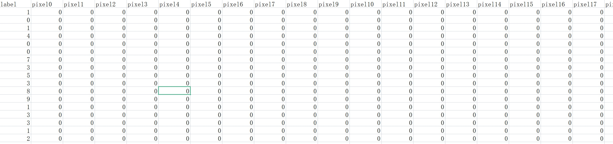
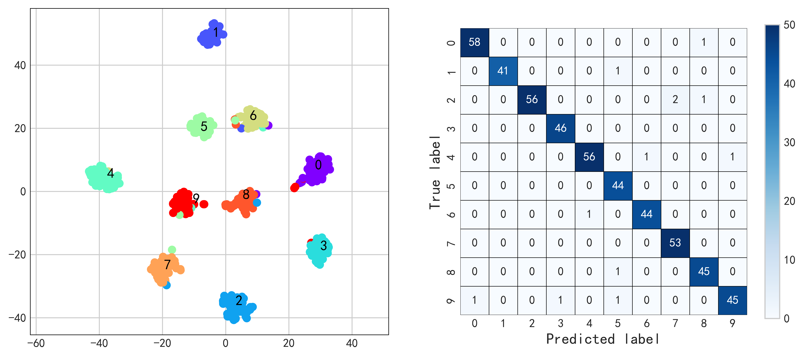

# 用浅层神经网络实现对MNIST数据集分类

使用时需要将dataset目录中的MNIST_train.zip解压到当前目录下

## MNIST数据集的读取

MNIST（Modified National Institute of Standards and Technology）手写数字数据集是一个经典的机器学习数据集，常用于测试和验证图像处理和机器学习算法的性能。该数据集由美国国家标准与技术研究院（NIST）于20世纪80年代收集而成，后经过修改而得名。

MNIST数据集包含了大约70,000张28x28像素的灰度图像，每张图像都是手写的单个数字（0到9之间的数字）。这些图像被分为60,000张用于训练，以及10,000张用于测试。每个图像都配有相应的标签，表示图像中所包含的数字。该数据集被广泛用于机器学习和深度学习的入门教程、示例和基准测试中。研究人员和从业者通常使用这个数据集来验证新的图像处理和分类算法的性能。由于MNIST相对较小，容易处理，因此它成为了许多学术和实际项目的起点。在训练深度学习模型时，研究者经常使用MNIST数据集来验证模型的有效性和性能，尤其是在图像分类任务中。然而，随着深度学习领域的发展，一些研究者逐渐开始使用更大、更具挑战性的图像数据集，以更全面地评估模型的泛化能力。

我们使用Python中的Numpy和Pandas完成数据读取，使用Matplotlib和Seaborn完成数据可视化，使用Torch搭建一个简单的卷积神经网络完成分类。

首先导入我们使用的库：

~~~python
%matplotlib inline
import numpy as np
import pandas as pd
import matplotlib.pyplot as plt
import seaborn as sns

import torch
from torch import nn
from torch.utils.data import Dataset
from torch.utils.data import DataLoader
from torch.optim.lr_scheduler import StepLR

from sklearn.model_selection import train_test_split

from tqdm import tqdm

import warnings
warnings.filterwarnings("ignore")

plt.style.use('seaborn-whitegrid')
~~~

我们使用的MNIST数据集的形式为一个具有785列的csv文件。其中第一个变量为该样本的标签，其余的784列表示为$28 \times 28$大小的图像展平后的像素点。

下面我们使用Pandas的read_csv函数读取文件，其结果为DataFrame的数据框的形式。

~~~python
df_train = pd.read_csv('dataset/MNIST_train.csv')
~~~

我们使用以下代码绘制出训练集合中前25个图像：

~~~python
fig, ax = plt.subplots(nrows=5, ncols=5, figsize=(10, 10))

count = 0
for i in range(5):
    for j in range(5):
        data = np.array(df_train.loc[count])
        sample, label = data[1:], data[0]
        count += 1
        ax[i][j].imshow(sample.reshape(28, 28))
~~~

## Dataset和DataLoader的构建

使用Torch作为深度学习框架最好将训练数据封装为DataLoader的形式，从中取数据进行训练，在此我们搭建了自己的Dataset对象，主要负责取训练样本和标签。

~~~python
class MyDataset(Dataset):
    """构建自己的Dataset对象"""

    def __init__(self, samples, labels):
        self.samples = samples
        self.labels = labels

    def __len__(self):
        return len(self.labels)

    def __getitem__(self, idx):
        label = self.labels[idx]
        sample = self.samples[idx]
        return sample, label
~~~

随后我们写了一个接口来获得训练和测试使用的DataLoader对象，这里我们将784长度的一维向量给reshape成为了一张$28 \times 28$大小的灰度图，期间注意类型转换，需要手动添加一个颜色通道。

~~~python
def interface(name, num, split, batch_size=10):
    """获得训练使用的DataLoader的接口函数"""

    samples, labels = [], []

    df_train = pd.read_csv(name)

    for i in tqdm(range(min(num, len(df_train)))):
        data = np.array(df_train.loc[i])
        samples.append(data[1:].reshape(28, 28))
        labels.append(data[0])

    X = np.array(samples)[:, np.newaxis]
    y = np.array(labels)
    
    # print(X.shape, y.shape)
    
    X_train, X_test, y_train, y_test = train_test_split(X, y, test_size=split)
    
    # print(X_train.shape, X_test.shape)

    return (DataLoader(dataset=MyDataset(samples=X_train,
                                         labels=y_train),
                       batch_size=batch_size, shuffle=True),
            DataLoader(dataset=MyDataset(samples=X_test,
                                         labels=y_test)))
~~~

## 搭建的卷积神经网络

我们搭建了一个简单的卷积神经网络来完成图像的分类，该网络包括的四层$3 \times 3$的等宽卷积，每层卷积后进行批量归一化BatchNorm操作以及ReLU激活函数。后三次卷积中进行了池化步长为$2 \times 2$大小的池化操作。

卷积神经网络（Convolutional Neural Network，CNN）是一类专门用于处理具有网格结构数据的神经网络。最常见的应用是图像处理，但它们也广泛用于视频分析、自然语言处理等领域。CNN的核心思想是通过卷积操作捕捉输入数据中的空间结构信息，以提取特征，并通过池化操作减少数据的维度。

MNIST的每个$28 \times 28$大小的样本经过ConvNet网络后，将会变为$3 \times 3$大小，并且具有256个不同的通道。

我们使用view操作将其展平后，乘以256个通道，随后被全连接层接收，这里我们使用了两层，且中间带有Dropout和ReLU激活函数的全连接神经网络。

~~~python
class ConvBlock(nn.Module):
    """辅助模块"""

    def __init__(self, in_channels, out_channels, maxpool=False):
        super().__init__()

        self.conv = nn.Sequential(
            nn.Conv2d(in_channels=in_channels, out_channels=out_channels,
                      kernel_size=(3, 3), stride=(1, 1), padding=1),
            nn.BatchNorm2d(out_channels),
            nn.ReLU(inplace=True),
        )

        if maxpool is True:
            self.conv.add_module(name='maxpool',
                                 module=nn.MaxPool2d(2))

    def forward(self, x):
        return self.conv(x)

class ConvNet(nn.Module):
    """用于MNIST手写字体分类的卷积神经网络"""

    def __init__(self):
        super().__init__()

        self.conv = nn.Sequential(
            ConvBlock(in_channels=1, out_channels=32, maxpool=False),
            ConvBlock(in_channels=32, out_channels=64, maxpool=True),
            ConvBlock(in_channels=64, out_channels=128, maxpool=True),
            ConvBlock(in_channels=128, out_channels=256, maxpool=True),
        )

        self.fnn = nn.Sequential(
            nn.Linear(256 * 3 * 3, 128),
            nn.Dropout(p=0.1),
            nn.ReLU(inplace=True),
            nn.Linear(128, 10),
        )

    def forward(self, x):
        x = self.conv(x)
        x = x.view(-1, 256 * 3 * 3)
        return self.fnn(x)
~~~

## 网络的训练

我们将网络的训练过程封装为一个函数，传入的参数为定义的网络，训练的轮数，使用的优化器optimizer，动态调整学习率的scheduler，使用的损失函数criterion，训练和测试使用的DataLoader对象，以及使用的批量大小等。为了更好的观察网络的训练过程，我们使用tqdm库创建了进度条方便观察。

~~~python
def train_network(net, num_epochs, optimizer, scheduler, criterion,
                  train_loader, test_loader,
                  batch_size, length, test_epochs):
    """训练神经网络所用的函数"""

    # 记录训练信息
    count = 0
    train_loss = np.zeros([num_epochs, 1])
    train_acc = np.zeros([num_epochs, 1])
    test_acc = np.zeros([num_epochs, 1])

    for epoch in range(num_epochs):
        net.train()
        loss_x = 0
        with tqdm(total=length, desc=f'Epoch {epoch + 1}') as pbar:
            for i, train_data in enumerate(train_loader, 1):
                data, labels = train_data
                data = data.double()
                labels = labels.long()
                optimizer.zero_grad()
                predict_label = net(data)
                loss = criterion(predict_label, labels)
                loss_x += loss.item()
                loss.backward()
                optimizer.step()
                count += 1
                pbar.update(1)
            train_loss[epoch] = loss_x / (batch_size * i)

            # 计算并打印训练周期结束后的准确率
            net.eval()
            # 记录训练和验证集中正确和总的个数
            total_correct_train = 0
            total_samples_train = 0
            total_correct_test = 0
            total_samples_test = 0

            with torch.no_grad():
                for batch_data in train_loader:
                    # 取测试数据
                    inputs, label = batch_data
                    inputs = inputs.double()
                    label = label.long()
                    # 前向传播
                    outputs = net(inputs)
                    # 计算准确率
                    _, predicted = torch.max(outputs, 1)
                    total_correct_train += (predicted == label).sum().item()
                    total_samples_train += label.size(0)

                if epoch >= test_epochs:
                    for batch_data in test_loader:
                        # 取测试数据
                        inputs, label = batch_data
                        inputs = inputs.double()
                        label = label.long()
                        # 前向传播
                        outputs = net(inputs)
                        # 计算准确率
                        _, predicted = torch.max(outputs, 1)
                        total_correct_test += (predicted == label).sum().item()
                        total_samples_test += label.size(0)

            # 计算准确率
            acc_train = total_correct_train / total_samples_train
            train_acc[epoch] = acc_train
            if epoch >= test_epochs:
                acc_test = total_correct_test / total_samples_test
                test_acc[epoch] = acc_test

            pbar.set_postfix({'Train count': count,
                              'Loss': train_loss[epoch][0],
                              'Train acc': str(train_acc[epoch][0] * 100)[: 6] + '%',
                              'Test acc': str(test_acc[epoch][0] * 100)[: 6] + '%'})

        # 动态调整学习率
        scheduler.step()

    print("Highest Accuracy:", test_acc.max())
    return train_loss, train_acc, test_acc
~~~

## 网络的训练结果

在以下代码中我们创建神经网络并开始网络的训练，我们一共使用了1000个样本，并将其对半分为了训练集和测试集，其样本量都为250，并设置batch_size=10。下面我们一共训练了40轮，并使得网络的损失降得足够小。

~~~python
train_num = 1000
batch_size = 10

net = ConvNet().double()

criterion = nn.CrossEntropyLoss(size_average=False)
# optimizer = torch.optim.SGD(net.parameters(), lr=0.008)
optimizer = torch.optim.Adam(net.parameters())
scheduler = StepLR(optimizer, step_size=20, gamma=0.5)

train_loader, test_loader = interface(name='dataset/MNIST_train.csv', num=1000, split=0.5, batch_size=batch_size)

length = int(train_num / batch_size / 2)

train_loss, train_acc, test_acc = train_network(net=net, num_epochs=40, optimizer=optimizer, scheduler=scheduler,
              criterion=criterion, train_loader=train_loader, test_loader=test_loader,
              batch_size=batch_size, length=length, test_epochs=0)
~~~

从可视化的结果中可以看到，一个简单的卷积神经网络即可对MNIST数据集实现非常好的训练效果，且并未发生过拟合，该网络结构经过调参之后应该能够取得更好的训练效果。

## t-SNE降维图与混淆矩阵

